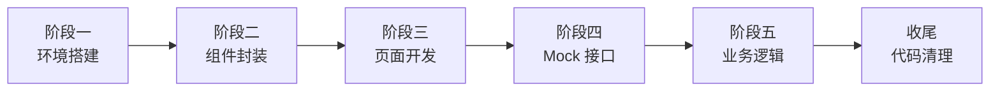

# tel-h5-vue

运营商通信套餐推广 H5 项目 —— 基于 Vue3 + Vite 开发的移动端营销页面，支持套餐展示、详情查看、在线预约功能。

## 技术栈

| 类别 | 技术 |
|------|------|
| 框架 | Vue 3 (Composition API + `<script setup>`) |
| 构建 | Vite 5 |
| 路由 | Vue Router 4 |
| HTTP | Axios |
| 样式 | CSS3（vw 移动端适配，设计稿 375px） |
| 数据 | Mock 模拟接口（Vite 内置插件拦截） |

## 功能页面

| 页面 | 路由 | 功能 |
|------|------|------|
| 首页 | `/` | Banner 自动轮播、分类筛选、套餐卡片列表 |
| 套餐详情 | `/detail/:id` | 权益 / 资费表格 / 多规格切换 / 动态价格 |
| 在线预约 | `/booking` | 套餐回显、表单校验、提交预约 |
| 预约成功 | `/booking/success` | 结果提示、返回导航 |

## 目录结构

```
tel-h5-vue/
├── public/
│   ├── images/               # Banner 占位图（SVG）
│   └── icons/                # 导航/分类/权益图标（SVG）
├── src/
│   ├── api/
│   │   └── package.js        # 接口封装（getPackageList / getPackageDetail / submitBooking）
│   ├── assets/
│   │   └── css/
│   │       └── global.css    # CSS Reset + 工具类 + 安全区域适配
│   ├── components/
│   │   ├── NavBar.vue        # 顶部导航栏（标题 / 返回 / 右插槽）
│   │   ├── TabBar.vue        # 底部菜单栏（图标 + 激活态）
│   │   ├── PackageCard.vue   # 套餐卡片（名称 / 价格 / 标签 / 特征）
│   │   └── Dialog.vue        # 通用弹窗（确认 / 取消 / v-model）
│   ├── mock/
│   │   ├── data.js           # 6 个套餐完整数据集
│   │   └── handler.js        # 请求路由器（延迟 / 校验 / 三接口分发）
│   ├── router/
│   │   └── index.js          # 4 条路由 + 全局标题守卫
│   ├── utils/
│   │   ├── request.js        # Axios 实例（baseURL / 拦截器）
│   │   └── validate.js       # 手机号正则 / 非空校验
│   ├── views/
│   │   ├── Home/index.vue    # 首页
│   │   ├── Detail/index.vue  # 详情页
│   │   ├── Booking/
│   │   │   ├── index.vue     # 预约页
│   │   │   └── Success.vue   # 成功页
│   ├── App.vue               # 根组件
│   └── main.js               # 入口
├── index.html
├── vite.config.js            # Vite + Mock 插件 + @ 别名
├── postcss.config.js         # px → vw 配置（375px 设计稿）
├── .gitignore
└── package.json
```

## Mock 接口

| 方法 | 路径 | 说明 |
|------|------|------|
| GET | `/api/package/list` | 套餐列表（支持 `?category=` 筛选） |
| GET | `/api/package/detail?id=` | 套餐详情 |
| POST | `/api/booking` | 提交预约 `{ name, phone, packageId, specId, remark }` |

> 接口由 `vite.config.js` 中的 `mockPlugin` 在开发服务器层拦截处理，切换真实后端时删除该插件即可。

## 开发流程



## 运行

```bash
# 安装依赖
npm install

# 启动开发服务器
npm run dev

# 生产构建
npm run build
```

## 移动端适配

采用 `postcss-px-to-viewport-8-plugin` 方案：

- 设计稿宽度：**375px**
- 换算公式：**1vw = 3.75px**
- 开发时直接写 `px`，构建时自动转换为 `vw`

## Git 提交记录

```
37b151e  chore: 代码清理与优化
78a2711  feat: 完成业务逻辑开发与健壮性优化
af3a203  feat: 接入Mock接口数据
9f6789f  feat: 完成三个核心页面静态开发
52299cd  feat: 完成公共组件封装
b3227ec  feat: 初始化Vue3项目结构
```
